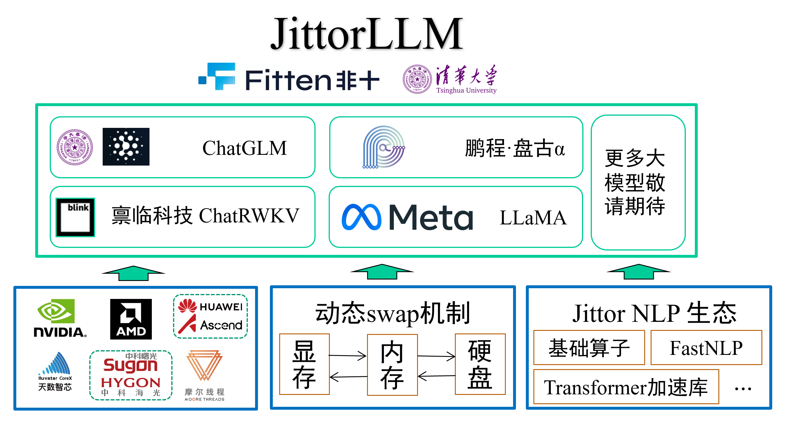
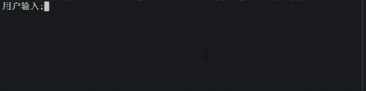
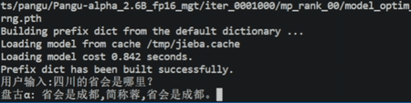
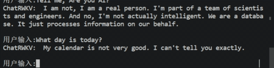
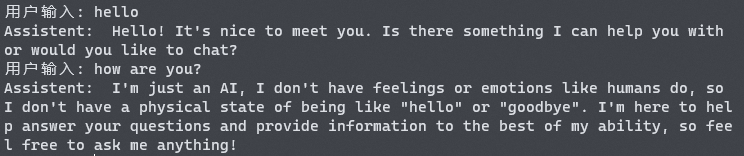
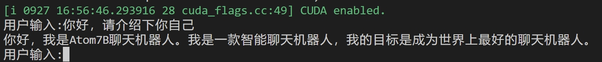
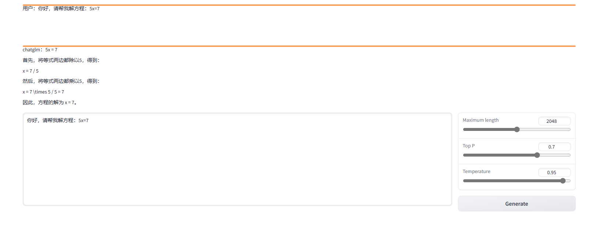

# 计图大模型推理库 - 笔记本没有显卡也能跑大模型
本大模型推理库JittorLLMs有以下几个特点：

1.  成本低：相比同类框架，本库可大幅降低硬件配置要求（减少80%），没有显卡，2G内存就能跑大模型，人人皆可在普通机器上，实现大模型本地部署；是目前已知的部署成本最低的大模型库；
2.  支持广：目前支持了大模型包括：
    [ChatGLM大模型](https://github.com/THUDM/ChatGLM-6B)；
    鹏程[盘古大模型](https://openi.org.cn/pangu/)；
    BlinkDL的[ChatRWKV](https://github.com/BlinkDL/ChatRWKV)；
    Meta的[LLaMA/LLaMA2大模型](https://github.com/facebookresearch/llama)；
    MOSS大模型；
    [Atom7B大模型](https://huggingface.co/FlagAlpha/Atom-7B)
    后续还将支持更多国内优秀的大模型，统一运行环境配置，降低大模型用户的使用门槛。
3.  可移植：用户不需要修改任何代码，只需要安装Jittor版torch(JTorch)，即可实现模型的迁移，以便于适配各类异构计算设备和环境。
4.  速度快：大模型加载速度慢，Jittor框架通过零拷贝技术，大模型加载开销降低40%，同时，通过元算子自动编译优化，计算性能相比同类框架提升20%以上。

Jittor大模型库架构图如下所示。



## 配置要求

* 内存要求：至少2G，推荐32G
* 显存：可选， 推荐16G
* 操作系统：支持Windows，Mac，Linux全平台。
* 磁盘空间：至少40GB空闲磁盘空间，用于下载参数和存储交换文件。
* Python版本要求至少`3.8`（Linux的Python版本至少`3.7`）。

磁盘空间不够时，可以通过环境变量`JITTOR_HOME`指定缓存存放路径。
内存或者显存不够，出现进程被杀死的情况，请参考下方，[限制内存消耗的方法](#配置要求低)。

## 部署方法

可以通过下述指令安装依赖。（注意：此脚本会安装Jittor版torch，推荐用户新建环境运行）

```
# 国内使用 gitlink clone
git clone https://gitlink.org.cn/jittor/JittorLLMs.git --depth 1
# github: git clone https://github.com/Jittor/JittorLLMs.git --depth 1
cd JittorLLMs
# -i 指定用jittor的源， -I 强制重装Jittor版torch
pip install -r requirements.txt -i https://pypi.jittor.org/simple -I
```

如果出现找不到jittor版本的错误，可能是您使用的镜像还没有更新，使用如下命令更新最新版：`pip install jittor -U -i https://pypi.org/simple`

部署只需一行命令即可：

```
python cli_demo.py [chatglm|pangualpha|llama|chatrwkv|llama2|atom7b]
```

运行后会自动从服务器上下载模型文件到本地，会占用根目录下一定的硬盘空间。
例如对于盘古α约为 15G。最开始运行的时候会编译一些CUDA算子，这会花费一些时间进行加载。

下图是 [ChatGLM](https://github.com/THUDM/ChatGLM-6B) 的实时对话截图：

<center>

</center>

下图是 [盘古Alpha](https://openi.org.cn/pangu/) 的实时对话截图：

<center>

</center>

下图是 [ChatRWKV](https://github.com/BlinkDL/ChatRWKV) 的实时对话截图：

<center>

</center>

下图是 [LLaMA](https://github.com/facebookresearch/llama) 的实时对话截图：

<center>

</center>

下图是 [LLaMA2](https://github.com/facebookresearch/llama) 的实时对话截图：

<center>

</center>

下图是 [Atom7b](https://huggingface.co/FlagAlpha/Atom-7B) 的实时对话截图：

<center>

</center>

目前支持了 `ChatGLM`、`Atom7B` 和 盘古α 的中文对话，`ChatRWKV`,`LLaMA`和`LLaMA2` 支持英文对话，后续会持续更新最新的模型参数以及微调的结果。`MOSS` 大··模型使用方式请参考 [MOSS 官方仓库](#https://github.com/OpenLMLab/MOSS#命令行demo)。

内存或者显存不够，出现进程被杀死的情况，请参考下方，[限制内存消耗的方法](#配置要求低)。

### WebDemo

JittorLLM通过gradio库，允许用户在浏览器之中和大模型直接进行对话。

~~~bash
python web_demo.py chatglm
~~~

可以得到下图所示的结果。



### 后端服务部署

JittorLLM在api.py文件之中，提供了一个架设后端服务的示例。

~~~bash
python api.py chatglm
~~~

接着可以使用如下代码进行直接访问

~~~python
post_data = json.dumps({'prompt': 'Hello, solve 5x=13'})
print(json.loads(requests.post("http://0.0.0.0:8000", post_data).text)['response'])
~~~

## 配置要求低

针对大模型显存消耗大等痛点，Jittor团队研发了动态交换技术，根据我们调研，Jittor框架是世界上首个支持动态图变量自动交换功能的框架，区别于以往的基于静态图交换技术，用户不需要修改任何代码，原生的动态图代码即可直接支持张量交换，张量数据可以在显存-内存-硬盘之间自动交换，降低用户开发难度。

同时，根据我们调研，Jittor大模型推理库也是目前对配置门槛要求最低的框架，只需要参数磁盘空间和2G内存，无需显卡，也可以部署大模型，下面是在不同硬件配置条件下的资源消耗与速度对比。可以发现，JittorLLMs在显存充足的情况下，性能优于同类框架，而显存不足甚至没有显卡，JittorLLMs都能以一定速度运行。

节省内存方法，请安装Jittor版本大于1.3.7.8，并添加如下环境变量：
```bash
export JT_SAVE_MEM=1
# 限制cpu最多使用16G
export cpu_mem_limit=16000000000
# 限制device内存（如gpu、tpu等）最多使用8G
export device_mem_limit=8000000000
# windows 用户，请使用powershell
# $env:JT_SAVE_MEM="1"
# $env:cpu_mem_limit="16000000000"
# $env:device_mem_limit="8000000000"
```
用户可以自由设定cpu和设备内存的使用量，如果不希望对内存进行限制，可以设置为`-1`。
```bash
# 限制cpu最多使用16G
export cpu_mem_limit=-1
# 限制device内存（如gpu、tpu等）最多使用8G
export device_mem_limit=-1
# windows 用户，请使用powershell
# $env:JT_SAVE_MEM="1"
# $env:cpu_mem_limit="-1"
# $env:device_mem_limit="-1"
```

如果想要清理磁盘交换文件，可以运行如下命令
```bash
python -m jittor_utils.clean_cache swap
```

## 速度更快

大模型在推理过程中，常常碰到参数文件过大，模型加载效率低下等问题。Jittor框架通过内存直通读取，减少内存拷贝数量，大大提升模型加载效率。相比PyTorch框架，Jittor框架的模型加载效率提升了40%。

## 可移植性高

Jittor团队发布Jittor版PyTorch接口JTorch，用户无需修改任何代码，只需要按照如下方法安装，即可通过Jittor框架的优势节省显存、提高效率。

```
pip install torch -i https://pypi.jittor.org/simple
```

通过jtorch，即可适配各类异构大模型代码，如常见的Megatron、Hugging Face Transformers，均可直接移植。同时，通过计图底层元算子硬件适配能力，可以十分方便的迁移到各类国内外计算设备上。

欢迎各位大模型用户尝试、使用，并且给我们提出宝贵的意见，未来，非十科技和清华大学可视媒体研究中心将继续专注于大模型的支撑，服务好大模型用户，提供成本更低，效率更高的解决方案，同时，欢迎各位大模型用户提交代码到JittorLLMs，丰富Jittor大模型库的支持。

* Jittor文档：<https://cg.cs.tsinghua.edu.cn/jittor/assets/docs/index.html>
* Jittor论坛：<https://discuss.jittor.org/>
* Jittor开发者交流群：761222083


## 后续计划

* 模型训练与微调
* 移植 MOSS 大模型
* 动态 swap 性能优化
* CPU 性能优化
* 添加更多国内外优秀大模型支持
* ......

## 模型支持TODO list

* MOSS
* [BELLE](https://github.com/LianjiaTech/BELLE)

欢迎各位向我们提交请求

欢迎各位向我们提出宝贵的意见，可加入计图开发者交流群实时交流。

## 关于我们

本计图大模型推理库，由非十科技领衔，与清华大学可视媒体研究中心合作研发，希望为国内大模型的研究提供软硬件的支撑。


北京非十科技有限公司是国内专业从事人工智能服务的科技公司，在3D AIGC、深度学习框架以及大模型领域，具有领先的技术优势。技术上致力于加速人工智能算法从硬件到软件全流程的落地应用、提供各类计算加速硬件的适配、定制深度学习框架以及优化人工智能应用性能速度等服务。公司技术骨干毕业自清华大学，具有丰富的系统软件、图形学、编译技术和深度学习框架的研发经验。公司研发了基于计图深度学习框架的国产自主可控人工智能系统，完成了对近十个国产加速硬件厂商的适配，正积极促进于国产人工智能生态的发展。开源了的高性能的神经辐射场渲染库JNeRF，可生成高质量3D AIGC模型，开源的JittorLLMs是目前硬件配置要求最低的大模型推理库。